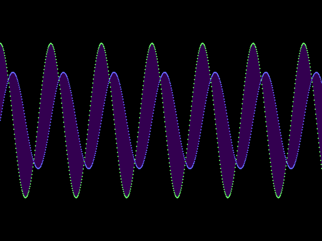
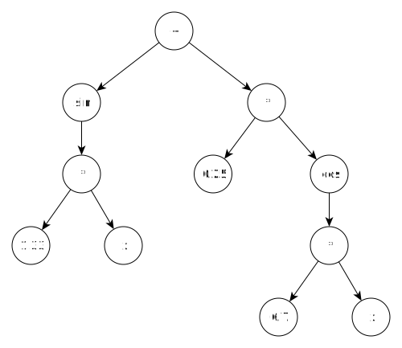

<div class='admonition caution'>
<div class='title'>Caution</div>
<div class='content'>
<ul>
<li>You are expected to work in a team of two or three.</li>
<li><strong>Due: Thursday July 28th at 11pm EDT (Baltimore time).</strong></li>
</ul>
</div>
</div>


## Learning Objectives

<div class='admonition success'>
<div class='title'>Objectives</div>
<div class='content'>
<ul>
<li>Reading and writing file data</li>
<li>Classes and objects</li>
<li>Constructors, destructors, assignment operators, and the rule of 3</li>
<li>Object-oriented design</li>
<li>Operator overloading</li>
<li>Trees (dynamic linked structures)</li>
<li>Recursion</li>
<li>Exceptions and exception handling</li>
</ul>
</div>
</div>

## Overview

*Note: this is preliminary content. It should not be considered official
unless it is announced in class and posted to the course website.*

In this project, you will implement a program to render images based on
plotting mathematical functions.

### An example plot

Here is an example plot input file. (This is available as `input/example04.txt` in
the starter files.)

```
Plot 0 -2.5 40 2.5 640 480
Function fn1 ( sin x )
Function fn2 ( * 1.6 ( cos x ) )
Color fn1 100 100 255
Color fn2 100 255 100
FillBetween fn1 fn2 0.4 128 0 200
```

This plot produces the following image (click for full size):

<a href="img/final/example04.png"></a>

Here is a quick overview of the meaning of the example plot input file:

* The `Plot` directive indicates that the plot will show the region
  of the x/y coordinate plane where $$0 \le x \le 40$$ and $$-2.5 \le y \le 2.5$$,
  and the generated image will have the dimensions 640x480
* The first `Function` directive indicates that the function called
  `fn1` will plot the function $$y=\sin x$$
* The second `Function` directive indicates that the function called
  `fn2` will plot the function $$y=1.6 (\cos x)$$
* The first `Color` directive indicates that the plot of `fn1` will use
  the color $$(100,100,255)$$ (colors are RGB triples, with color component
  values in the range 0–255)
* The second `Color` directive indicates that the function called `fn2`
  will use the color $$(100,255,100)$$
* The `FillBetween` directive indicates that the area between `fn1` and
  `fn2` should be filled with the color $$(128,0,200)$$ at an opacity
  of $$0.4$$

The detailed semantics of the various directives are described below.

## Getting started

To get started on the project, use `git clone` to clone the final project
repository we have created for you. Also, use `git pull` to make sure that
your clone of the `cs220-summer22-public` repository is up to date.
Then, copy the starter files into your final project repository.
Assuming your current directory is your clone of your team's final project
repository, you could use the following commands to copy the files:

```
cp -r ~/cs220-summer22-public/projects/final/* .
cp ~/cs220-summer22-public/projects/final/.gitignore .
```

Once you have copied the starter files, use `git add`, `git commit`,
and `git push` to incorporate them into your team's repository.

## Deliverables

There are three deliverables:

1. The program code, along with a `README` and `gitlog.txt`
2. A [UML class diagram](#uml-diagram) showing the important classes in the
   program and their relationships
3. Completing the Final Project Contributions survey on Gradescope

One member of the team (and *only* one member!) should submit deliverables 1–2
to Gradescope in a zipfile.  See the [Submitting](#submitting) section.
Be sure to add all of the group members to the submission on Gradescope.

Each team member will need to complete the final project contributions survey
on Gradescope individually.

## Detailed semantics

### Compiling, program invocation

The `Makefile` should produce an executable called `plot`. As always,
we expect your code to compile without warnings with the compiler
options `-std=c++11 -Wall -Wextra -pedantic`. You can use the provided
`Makefile`, although if you want to write your own, or modify the
provided one, you can.

Note that the provided `Makefile` doesn't have any explicit targets for
object (`.o`) files.  These are generated by running the command

```
make depend
```

This works by having the compiler analyze the source files to determine
which header files each one depends on.  Note that if you modify any
source or header files to add or remove `#include` directives, you
should run `make depend` again to regenerate the source and header
file dependencies.

The program is invoked as

<div class="highlighter-rouge"><pre>
./plot <i>input_file</i> <i>output_file</i>
</pre></div>

The *input\_file* argument specifies the input [plot file](#plot-files).
The *output\_file* argument is the PNG image file to write. (It should end
in the file extension `.png`.)

### Plot files

A plot file is a series of directives. Each directive is specified on
one input line. There are 6 types of directives: `Plot`, `Function`, `Color`,
`FillAbove`, `FillBelow`, and `FillBetween`.

The items in a directive will be each be separated by at least one whitespace
character. It is also possible that there could be leading or trailing
whitespace characters in a directive.

The `Plot` directive has the following form:

<div class="highlighter-rouge"><pre>
Plot <i>xmin</i> <i>ymin</i> <i>xmax</i> <i>ymax</i> <i>width</i> <i>height</i>
</pre></div>

The *xmin*, *ymin*, *xmax*, and *ymax* floating point values define the region of the
x/y coordinate plane rendered by the plot. The *width* and *height* integer values
specify the dimensions of the rendered image. Note that *xmin* must be less than *xmax*,
and *ymin* must be less than *ymin*. Also, *width* and *height* must both be positive.

A plot input file *must* specify exactly one `Plot` directive.

The `Function` directive has the following form:

<div class="highlighter-rouge"><pre>
Function <i>fn_name</i> <i>expression</i>
</pre></div>

*fn\_name* is the name of the function, so that it can be referred to by
`Color` directives and the various `Fill` directives.
*expression* is a sequence of one or more tokens consistuing a prefix expression
which specifies the mathematical function to be plotted.
(See [Functions and expressions](#functions-and-expressions) below for details.)

The `Color` directive has the following form:

<div class="highlighter-rouge"><pre>
Color <i>fn_name</i> <i>r</i> <i>g</i> <i>b</i>
</pre></div>

*fn\_name* is the name of a function defined in a `Function` directive.
*r*, *g*, and *b* are the R/G/B color component values for the color
with which the function should be plotted.

The `FillAbove` directive has the following form:

<div class="highlighter-rouge"><pre>
FillAbove <i>fn_name</i> <i>opacity</i> <i>r</i> <i>g</i> <i>b</i>
</pre></div>

*fn\_name* is the name of a function defined in a `Function` directive.
*opacity* is a floating point value between 0.0 and 1.0 (inclusive)
specifying the opacity of the fill color.
*r*, *g*, and *b* are the R/G/B color component values for the fill color.

The `FillBelow` directive has the following form:

<div class="highlighter-rouge"><pre>
FillBelow <i>fn_name</i> <i>opacity</i> <i>r</i> <i>g</i> <i>b</i>
</pre></div>

The values in a `FillBelow` directive have the same meaning as in a
`FillAbove` directive.

The `FillBetween` directive has the following form:

<div class="highlighter-rouge"><pre>
FillBetween <i>fn_name1</i> <i>fn_name2</i> <i>opacity</i> <i>r</i> <i>g</i> <i>b</i>
</pre></div>

The values in a `FillBetween` directive have the same meaning as in
`FillAbove` and `FillBelow` directives, except there are two function names,
*fn\_name1* and *fn\_name2*.

### Functions and expressions

The mathematical functions specified by `Function` directives are of the form
*y*=*expr*, where *expr* is a *prefix expression*.
Prefix expressions have one of the following forms:

* `x`
* `pi`
* a literal numeric (floating-point) value
* `(` *function\_name* *arguments* `)`

*function\_name* is one of `sin`, `cos`, `+`, `-`, `*`, and `/`.
*arguments* is a sequence of 0 or more prefix expressions.
Because an expansion of *arguments* can include arbitrary (nested) prefix
expressions, prefix expressions are inherently recursive.

Prefix expressions are so-called because when a function is used, it
preceeds the argument values to which it is applied. The prefix expressions
in the `plot` program are similar to [Lisp S-Expressions](https://en.wikipedia.org/wiki/S-expression).

A critical idea to understand is that expressions can and should be represented
as a [tree](https://en.wikipedia.org/wiki/Tree_(data_structure)). Nodes representing
`x`, `pi`, or a literal numeric value are *leaf nodes*, meaning that they
have no child nodes. A node representing a function will have one child
node for each argument expression.

For example, consider the following prefix expression:

```
( + ( sin ( * 1.33 x ) ) ( * 0.25 ( cos ( * 6.7 x ) ) ) )
```

We could write this as an infix expression as something like $$(\sin 1.33 x) + (0.25 (\cos 6.7 x))$$.
As a tree, this expression could be represented as



Note that every token in a prefix expression must be separated by at least one
whitespace character. This means that you can read the tokens in a prefix expression by
repeatedly extracting `std::string` values from the stream from which the expression
text is read.

The following pseudo-code explains how you could implement code to parse
a prefix expression and build an expression tree from it.

```
// assume tokens is a sequence of tokens comprising
// the prefix expression
function parsePfxExpr(tokens) {
  n = remove first token from tokens

  if (n is "x", "pi", or a literal number) {
    create appropriate expression node and return it
  } else if (n is a left parenthesis) {
    n = remove first token from tokens

    if (n is none of sin, cos, +, -, *, or /) {
      throw exception // invalid function name
    }

    result = create appropriate function node

    while (first token of tokens is not right parenthesis) {
      arg = parsePfxExpr(tokens)
      add arg as child of result
    }

    remove first token from tokens // should be right paren

    return result
  } else {
    throw exception // unexpected token
  }
}
```

Since the algorithm repeatedly examines and removes the first token
from the sequence of tokens, you might consider using a `std::deque`
container to store the tokens, since it supports a `pop_front()` operation.

### Representing a plot

Before attempting to render a plot image, the program should build
a complete representation of the plot directives as objects in memory.
The plot bounds and dimensions, as well as the function, color,
and fill directives should all be represented as objects that are
gathered in a central *plot object*.

### Producing a rendered image

TODO

## Design and implementation notes

Talk about the classes, general ideas about how to proceed with the
implementation.

Explicity state that the starter code can be modified as much as necessary.
But, also note that the program should be clean and well-designed.

## Testing

TODO

## UML Diagram

TODO

## Submitting

TODO
